# Agentic Workflow for Data Pipeline Enhancement 🤖

An intelligent, automated agentic workflow system integrated into existing data pipelines to dynamically enrich datasets based on drift detection. The system uses three sequential LangGraph agents to analyze drift, discover APIs, and collect new data to improve model performance.

## 🏗️ Pipeline Integration Architecture

```mermaid
graph LR
    A[Data Collection] --> B[Data Engineering] 
    B --> C[Feature Engineering CSV]
    C --> D[🤖 AGENTIC WORKFLOW]
    D --> E[Enhanced Feature Engineering CSV]
    E --> F[Feature Selection]
    F --> G[Model Training]
    
    subgraph "🤖 Agentic Workflow"
        D1[Drift Monitor Agent] --> D2[API Discovery Agent]
        D2 --> D3[Data Collection Agent]
    end
```



## 📋 Workflow Overview

The agentic workflow is **integrated between Data Engineering and Feature Selection** phases of your existing pipeline:

1. **Data Collection** → **Data Engineering** → **Feature Engineering CSV**
2. **🤖 Agentic Workflow** (3 agents) analyzes and enriches the CSV
3. **Enhanced CSV** → **Feature Selection** → **Model Training**

## 🔄 Three-Agent Sequential Process

### Agent 1: Drift Monitoring Agent 📊
**Purpose**: Analyzes feature engineering CSV for seasonal drift patterns

**LangGraph Flow**:


**Output**: `features_to_add` list when seasonal drift detected

### Agent 2: API Discovery Agent 🔍  
**Purpose**: Discovers and validates APIs for suggested features

**LangGraph Flow**:


**Key Features**:
- **Feature Comparison**: LLM checks if features exist under fancy names in current CSV
- **API Search**: Uses LLM + Tavily for candidate API discovery
- **Validation Loop**: Retries search if API validation fails
- **Logging**: Tracks found/skipped features for transparency

### Agent 3: Data Collection and Storage Agent 📥
**Purpose**: Collects, validates, and stores data from discovered APIs

**LangGraph Flow**:


**Key Features**:
- **Smart Validation**: Checks API response schema and completeness
- **LLM Data Fixing**: Automatically aligns unexpected fields with standard schema
- **Error Handling**: Logs failed API calls with detailed error information
- **Data Transformation**: Normalizes data before storage
- **Retry Logic**: Processes multiple APIs with individual error handling


## 🚀 Integration Points

### Input to Agentic Workflow
- **Source**: `full_preprocessed_aqi_weather_data_with_all_features` (from Data Engineering phase)
- **Trigger**: Automated after feature engineering completes
- **Format**: Engineered features ready for analysis

### Output from Agentic Workflow  
- **Destination**: Enhanced `full_preprocessed_aqi_weather_data_with_all_features` → Feature Selection
- **Content**: Original features + newly collected features
- **Quality**: Validated, cleaned, and LLM-verified data

## 🔧 LangGraph Agent Configurations

### Agent 1: Drift Monitor (Standalone Script)
```python
# drift_monitor/drift_analyzer.py
drift_config = {
    "input_csv": "feature_engineering.csv",
    "output_json": "drift_analysis.json", 
    "seasonal_threshold": 0.05,
    "github_integration": True,
    "llm_model": "gemini-1.5-flash"
}

# Triggers Discovery Agent only if seasonal drift detected
```

### Agent 2: Discovery Agent (LangGraph)
```python
# discovery_agent/discovery_state.py
class DiscoveryState(TypedDict):
    features_to_add: List[str]      # From drift_analysis.json
    current_feature: str            # Feature being processed
    feature_exists: bool            # LLM feature comparison result
    candidate_apis: List[dict]      # Tavily search results
    validated_api: dict             # Passed validation
    search_log: List[dict]          # Track search attempts
    status: str                     # "processing" | "complete" | "failed"

# Key Nodes:
# - feature_comparison_node: LLM checks existing CSV features  
# - api_search_node: LLM + Tavily API discovery
# - api_validator_node: Endpoint validation (docs, auth, schema)
# - logging_node: Track skipped/found features
```

### Agent 3: Collection Agent (LangGraph)  
```python
# collection_agent/collection_state.py
class CollectionState(TypedDict):
    api_list: List[dict]            # From Discovery Agent
    current_api: dict               # API being processed
    raw_response: dict              # API call result
    validation_errors: List[str]    # Schema/completeness issues
    transformed_data: dict          # Normalized, clean data
    storage_path: str               # Where data is saved
    error_log: List[dict]           # Failed API calls
    status: str                     # "fetching" | "valid" | "invalid" | "stored"

# Key Nodes:
# - fetcher_node: Call API endpoints, handle responses
# - validator_node: Check schema, completeness, data quality
# - llm_alignment_node: Fix unexpected/missing fields using LLM
# - transformer_node: Normalize data to standard format
# - storage_node: Save processed data to CSV/database
# - error_logger_node: Log failed API calls with details
```

## 🛠️ Running the Agentic Workflow

### Full Pipeline Integration
```bash
# Automatically triggered after data engineering
python pipeline_integration/workflow_orchestrator.py
```

### Manual Agent Execution (Development)
```bash
# Run agents sequentially
python agents/langgraph_agent/drift_monitor_agent/drift_agent.py
python agents/langgraph_agent/discovery_agent/run_discovery.py  
python agents/langgraph_agent/collection_agent/run_collection.py
```

## 📊 Key Features

### LLM-Powered Intelligence
- **Feature Similarity Check**: Prevents duplicate data collection
- **API Discovery**: Finds relevant data sources automatically  
- **Data Quality Fixes**: Automatically corrects incomplete data
- **Contextual Reasoning**: Understands domain-specific requirements

### Robust Error Handling
- **API Validation**: Tests endpoints before data collection
- **Data Validation**: Quality checks with LLM-suggested fixes
- **Retry Logic**: Automatic retry for failed operations
- **Graceful Degradation**: Continues pipeline even if enrichment fails

### Seamless Integration
- **Non-Disruptive**: Works with existing pipeline architecture
- **Backward Compatible**: Original pipeline continues if agents fail
- **Configurable**: Easy to adjust thresholds and parameters
- **Monitoring**: Full visibility into agent decisions and performance

## 📈 Benefits

- **Dynamic Enhancement**: Automatically improves datasets based on drift patterns
- **Zero Manual Intervention**: Fully automated feature discovery and collection
- **Quality Assurance**: LLM validation ensures data integrity  
- **Pipeline Continuity**: Minimal disruption to existing workflows
- **Scalable**: Easy to add new data sources and validation rules


### Performance Metrics
- Drift detection accuracy
- API discovery success rate
- Data collection completeness
- Feature enhancement impact on model performance

---

**Intelligent data pipeline enhancement through autonomous agent collaboration** 🚀